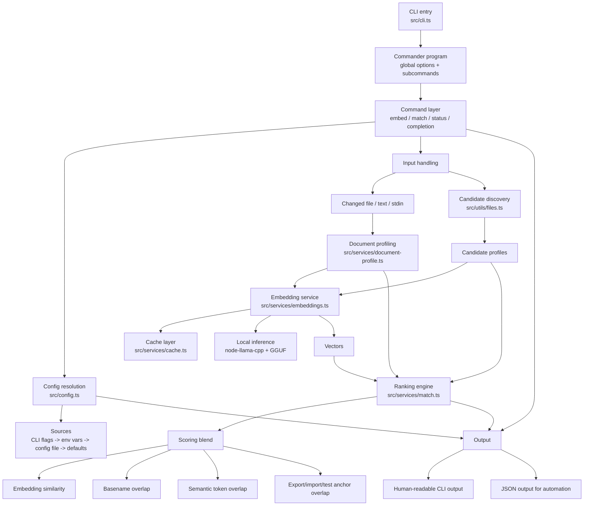

# semantic-test-matcher

`semantic-test-matcher` is a TypeScript CLI for semantic test matching. It exposes the `rbt` command, which can embed free-form text, inspect resolved runtime configuration, print shell completion scripts, and rank likely test files for a changed source file.

The matching flow combines:

- document profiling from file paths and code structure
- local GGUF embeddings through `node-llama-cpp`
- a local embedding cache
- score blending for semantic and structural signals

## Features

- `rbt match <file>` ranks candidate tests for a changed file
- `rbt embed [text]` generates an embedding for text or stdin
- `rbt status` shows the resolved runtime configuration
- `rbt completion [bash|zsh]` prints a shell completion script
- runs embeddings in-process with no cloud service or local daemon
- caches embeddings in `.rbt/cache` by default
- accepts candidate file lists from CLI flags, config, or stdin

## Architecture



## Requirements

- Node.js 20 or newer
- about 278 MB of disk space for the local embedding model

## Install

```bash
npm install --global semantic-test-matcher
```

From your project root, download the compatible EmbeddingGemma model:

```bash
npx --yes node-llama-cpp@3.19.0 pull \
  --dir models \
  --filename embeddinggemma-300M-Q4_0.gguf \
  hf:ggml-org/embeddinggemma-300M-qat-q4_0-GGUF:Q4_0
```

The model is stored at `models/embeddinggemma-300M-Q4_0.gguf`. You can use a different local GGUF file with `--model`. Model inference is fully local, and the model is distributed separately under the [Gemma license](https://huggingface.co/ggml-org/embeddinggemma-300M-qat-q4_0-GGUF).

Verify the installation:

```bash
rbt --version
rbt status
```

## Quick Start

Generate an embedding:

```bash
rbt embed "discount and tax edge cases" --json
```

Match a changed file to likely tests:

```bash
rbt match prompts-idea/src/price-engine.ts --candidates prompts-idea/tests --json
```

Inspect resolved settings:

```bash
rbt status --json
```

Print shell completion:

```bash
rbt completion zsh
```

## Commands

### `embed`

Embeds the provided text or stdin input.

Examples:

```bash
rbt embed "checkout pricing logic"
printf "coupon validation" | rbt embed --json
```

Useful flags:

- `--model <path-to-gguf>`
- `--cache-dir <path>`
- `--json`

### `match`

Ranks likely candidate files for a changed source file.

Examples:

```bash
rbt match prompts-idea/src/price-engine.ts --candidates prompts-idea/tests

cat prompts-idea/candidate-list.txt | \
  rbt match prompts-idea/src/price-engine.ts \
    --candidates-from-stdin \
    --top-k 4 \
    --threshold 0.35 \
    --json
```

Useful flags:

- `--threshold <number>`
- `--min-score <number>`
- `--top-k <number>`
- `--candidates <paths...>`
- `--include-file <glob...>`
- `--exclude-file <glob...>`
- `--candidates-from-stdin`
- `--model <path-to-gguf>`
- `--cache-dir <path>`
- `--diff-file <path>`
- `--diff-root <path>` (set the base for relative diff paths, such as `.` for `git diff --relative`)
- `--json`

How matching works:

1. The changed file is read and converted into a `DocumentProfile`.
2. Candidate files are collected from configured paths or stdin.
3. Each profile is embedded locally with the configured GGUF model.
4. `rankMatches` blends embedding similarity with structural overlap.
5. Results are filtered by threshold and truncated to `topK`.

### `status`

Prints the resolved runtime configuration and cache stats.

```bash
rbt status
rbt status --json
```

### `completion`

Prints a bash or zsh completion script.

```bash
rbt completion bash
rbt completion zsh
```

## Configuration

The CLI resolves settings in this order:

1. command flags
2. environment variables
3. config file
4. built-in defaults

Config files are loaded from:

- `--config <path>` if provided
- `.rbt/config.json`
- `.rbtconfig`

Example config:

```json
{
  "model": "models/embeddinggemma-300M-Q4_0.gguf",
  "cacheDir": ".rbt/cache",
  "logLevel": "info",
  "match": {
    "topK": 5,
    "threshold": 0,
    "candidatePaths": ["test", "tests"],
    "includePatterns": ["**/*"],
    "excludePatterns": [
      "**/dist/**",
      "**/.git/**",
      "**/node_modules/**",
      "**/build/**"
    ]
  }
}
```

Environment variables used by the resolver include:

- `RBT_MODEL`
- `RBT_CACHE_DIR`
- `RBT_LOG_LEVEL`
- `RBT_VERBOSE`
- `RBT_QUIET`
- `RBT_TOP_K`
- `RBT_MATCH_TOP_K`
- `RBT_THRESHOLD`
- `RBT_MATCH_THRESHOLD`
- `RBT_MIN_SCORE`
- `RBT_MATCH_MIN_SCORE`

## Local Embeddings and Caching

- uses `node-llama-cpp` with an embedding-capable local GGUF file
- defaults to `models/embeddinggemma-300M-Q4_0.gguf`
- applies EmbeddingGemma's `sentence similarity` prompt for semantic matching
- truncates oversized profiles to the embedding context
- does not call a cloud API or require a local model server

### Cache

- embeddings are cached under `.rbt/cache` by default
- cache writes are best-effort and do not fail the command if they break
- `status` reports the current cache entry count

## Repo Layout

```text
src/
  cli.ts                CLI entrypoint
  commands/             Commander subcommands
  services/             embeddings, ranking, document profiling, cache
  utils/                candidate collection, stdin helpers, glob matching
prompts-idea/
  src/                  synthetic source files for matching experiments
  tests/                synthetic tests used as candidates
  candidate-list.txt    sample stdin input for --candidates-from-stdin
  README.md             dataset-specific usage notes
```

## Sample Dataset: `prompts-idea/`

`prompts-idea/` is a small synthetic workspace for exercising the matcher. It includes source files, related and unrelated tests, and a candidate list file for stdin-driven matching flows.

Useful commands:

```bash
npm test

rbt match prompts-idea/src/price-engine.ts \
  --candidates prompts-idea/tests \
  --json

cat prompts-idea/candidate-list.txt | \
  rbt match prompts-idea/src/price-engine.ts \
    --candidates-from-stdin \
    --json
```

For dataset-specific notes, see [prompts-idea/README.md](./prompts-idea/README.md).

## Development

```bash
npm install
npm run lint
npm test
npm run build
```

The repo currently uses `node:test` for tests and TypeScript for type-checking and build output.
