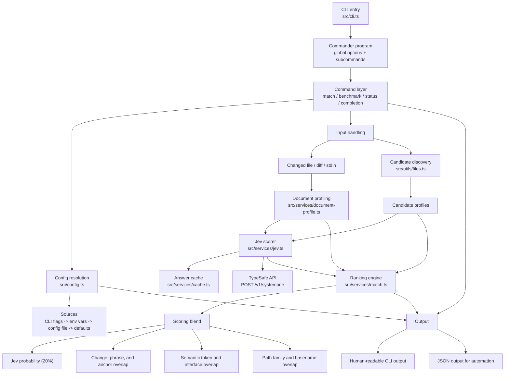

# semantic-test-matcher

`semantic-test-matcher` is a TypeScript CLI for semantic test matching. It exposes the `rbt` command, which ranks likely test files for a changed source file, inspects resolved runtime configuration, and prints shell completion scripts.

The matching flow combines:

- document profiling from file paths, code structure, and diffs
- TypeSafe's [Jev](https://docs.typesafe.ai/) System One model, which judges whether each candidate test file should re-run for the change
- a local answer cache
- score blending for Jev and structural signals

## Features

- `rbt match <file>` ranks candidate tests for a changed file
- `rbt benchmark` scores the matcher against a file of expected rankings
- `rbt status` shows the resolved runtime configuration
- `rbt completion [bash|zsh]` prints a shell completion script
- scores all candidates for a change in one Jev request, typically 150–500 ms
- falls back to local structural heuristics when no API key is available
- caches Jev answers in `.rbt/cache` by default
- accepts candidate file lists from CLI flags, config, or stdin

## Architecture


```mermaid
flowchart TD
    A["CLI entry<br/>src/cli.ts"] --> B["Commander program<br/>global options + subcommands"]
    B --> C["Command layer<br/>match / benchmark / status / completion"]

    C --> D["Config resolution<br/>src/config.ts"]
    D --> D1["Sources<br/>CLI flags -> env vars -> config file -> defaults"]

    C --> E["Input handling"]
    E --> E1["Changed file / diff / stdin"]
    E --> E2["Candidate discovery<br/>src/utils/files.ts"]

    E1 --> F["Document profiling<br/>src/services/document-profile.ts"]
    E2 --> F2["Candidate profiles"]

    F --> G["Jev scorer<br/>src/services/jev.ts"]
    F2 --> G
    G --> H["Answer cache<br/>src/services/cache.ts"]
    G --> I["TypeSafe API<br/>POST /v1/systemone"]

    G --> K["Ranking engine<br/>src/services/match.ts"]
    F --> K
    F2 --> K

    K --> L["Scoring blend"]
    L --> L1["Jev probability (20%)"]
    L --> L2["Change, phrase, and anchor overlap"]
    L --> L3["Semantic token and interface overlap"]
    L --> L4["Path family and basename overlap"]

    C --> M["Output"]
    K --> M
    D --> M
    M --> M1["Human-readable CLI output"]
    M --> M2["JSON output for automation"]
```

## Requirements

- Node.js 20 or newer
- a TypeSafe API key from [console.typesafe.ai/keys](https://console.typesafe.ai/keys) in `TYPESAFE_API_KEY` (without one, `rbt` ranks with local heuristics only)

## Install

```bash
npm install --global semantic-test-matcher
export TYPESAFE_API_KEY=...
```

Verify the installation:

```bash
rbt --version
rbt status
```

## Quick Start

Match a changed file to likely tests, passing the change as a diff:

```bash
git diff > change.diff
rbt match src/price-engine.ts --candidates tests --diff-file change.diff --json
```

Inspect resolved settings:

```bash
rbt status --json
```

Print shell completion:

```bash
rbt completion zsh
```

## Commands

### `match`

Ranks likely candidate files for a changed source file.

Examples:

```bash
rbt match prompts-idea/src/price-engine.ts --candidates prompts-idea/tests

cat prompts-idea/candidate-list.txt | \
  rbt match prompts-idea/src/price-engine.ts \
    --candidates-from-stdin \
    --top-k 4 \
    --threshold 0.35 \
    --json
```

Useful flags:

- `--threshold <number>`
- `--min-score <number>`
- `--top-k <number>`
- `--candidates <paths...>`
- `--include-file <glob...>`
- `--exclude-file <glob...>`
- `--candidates-from-stdin`
- `--ranker <jev|heuristics>`
- `--jev-model <id>`
- `--cache-dir <path>`
- `--diff-file <path>`
- `--diff-root <path>` (set the base for relative diff paths, such as `.` for `git diff --relative`)
- `--json`

How matching works:

1. The changed file (and its hunks from `--diff-file`) is read and converted into a `DocumentProfile`.
2. Candidate files are collected from configured paths or stdin.
3. Jev asks one yes/no question per candidate, "should the tests in this file be re-run to check this change?", and returns a probability. All candidates go in one request; larger suites are batched.
4. `rankMatches` blends the Jev probability (20%) with structural overlap (80%). With `--ranker heuristics`, or when Jev is unavailable, the structural score is used alone.
5. Results are filtered by threshold and truncated to `topK`.

### How Jev is used

- **Data leaves your machine.** Each request sends the changed file's path, exported symbol names, and its diff hunks (or, without `--diff-file`, the first 6,000 characters of the file), plus each candidate test file's path and test titles, to `api.typesafe.ai`. Candidate file bodies are not sent. Review TypeSafe's [data handling](https://docs.typesafe.ai/legal) before using it on private code. Use `--ranker heuristics` to keep everything local.
- **Pass a diff.** Jev is most useful with `--diff-file`, because it can then judge the actual change rather than the whole file.
- **Fallback.** If `TYPESAFE_API_KEY` is missing or the API fails after retries, `match` prints a warning to stderr and ranks with heuristics only. JSON output reports the effective `ranker` and a `rankerFallback` reason, so CI can detect the downgrade. `benchmark` fails instead of falling back.
- **Caching and model pinning.** Answers are cached per change and candidate in `<cacheDir>/jev.json`, so repeat runs make no requests. The default model is pinned to `jev-1.13.0`. `jev-latest` also works, but its answers can change when TypeSafe ships a new version.
- **Cost.** Jev bills input tokens only, at $0.042 per million. A change with ~30 candidates is roughly 2,000–7,000 tokens.

### `benchmark`

Runs the matcher over a JSON file of cases (`source`, optional `diffText`, and `expectedTop1`, `expectedTop3`, or `expectedTop10Includes`) and reports hit rates. It takes the same `--ranker`, `--jev-model`, candidate, and threshold flags as `match`.

```bash
rbt benchmark --cases cases.json --candidates tests --json
rbt benchmark --cases cases.json --candidates tests --ranker heuristics
```

### `status`

Prints the resolved runtime configuration, whether `TYPESAFE_API_KEY` is set, and cache stats.

```bash
rbt status
rbt status --json
```

### `completion`

Prints a bash or zsh completion script.

```bash
rbt completion bash
rbt completion zsh
```

## Configuration

The CLI resolves settings in this order:

1. command flags
2. environment variables
3. config file
4. built-in defaults

Config files are loaded from:

- `--config <path>` if provided
- `.rbt/config.json`
- `.rbtconfig`

Example config:

```json
{
  "ranker": "jev",
  "jevModel": "jev-1.13.0",
  "cacheDir": ".rbt/cache",
  "logLevel": "info",
  "match": {
    "topK": 5,
    "threshold": 0,
    "candidatePaths": ["test", "tests"],
    "includePatterns": ["**/*"],
    "excludePatterns": [
      "**/dist/**",
      "**/.git/**",
      "**/node_modules/**",
      "**/build/**"
    ]
  }
}
```

Environment variables used by the resolver include:

- `RBT_RANKER`
- `RBT_JEV_MODEL`
- `RBT_CACHE_DIR`
- `RBT_LOG_LEVEL`
- `RBT_VERBOSE`
- `RBT_QUIET`
- `RBT_TOP_K`
- `RBT_MATCH_TOP_K`
- `RBT_THRESHOLD`
- `RBT_MATCH_THRESHOLD`
- `RBT_MIN_SCORE`
- `RBT_MATCH_MIN_SCORE`

`TYPESAFE_API_KEY` supplies the Jev API key. It is only read from the environment, never from config files.

### Cache

- Jev answers are cached in `.rbt/cache/jev.json` by default, keyed by model, change, and candidate
- cache writes are best-effort and do not fail the command if they break
- `status` reports the current cache entry count

## Repo Layout

```text
src/
  cli.ts                CLI entrypoint
  commands/             Commander subcommands
  services/             Jev scoring, ranking, document profiling, cache
  utils/                candidate collection, stdin helpers, glob matching
prompts-idea/
  src/                  synthetic source files for matching experiments
  tests/                synthetic tests used as candidates
  candidate-list.txt    sample stdin input for --candidates-from-stdin
  README.md             dataset-specific usage notes
```

## Sample Dataset: `prompts-idea/`

`prompts-idea/` is a small synthetic workspace for exercising the matcher. It includes source files, related and unrelated tests, and a candidate list file for stdin-driven matching flows.

Useful commands:

```bash
npm test

rbt match prompts-idea/src/price-engine.ts \
  --candidates prompts-idea/tests \
  --json

cat prompts-idea/candidate-list.txt | \
  rbt match prompts-idea/src/price-engine.ts \
    --candidates-from-stdin \
    --json
```

For dataset-specific notes, see [prompts-idea/README.md](./prompts-idea/README.md).

## Development

```bash
npm install
npm run lint
npm test
npm run build
```

The repo currently uses `node:test` for tests and TypeScript for type-checking and build output. Tests stub the TypeSafe API and never make network calls.
